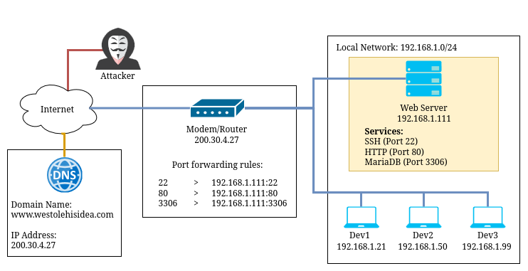

# Scenario Design

## Victim

A small, up-and-coming web development team fresh out of Swinburne operates with a single Linux server to keep costs low and offer competitive pricing. Without dedicated IT staff, the team members each have varying levels of technical expertise and share basic system administration duties. Their focus on affordability has resulted in limited security measures, exposing the business to risks while they strive to maintain essential services for customer orders and revenue.

### Key Points

- Single Linux server directly exposed to the internet via a residential ISP using a generic home modem/router, no DMZ or dedicated firewall
- Router port forwarding: 22 (SSH), 80 (HTTP), 3306 (MariaDB) directly to server
- Flat network topology with server on same subnet as personal devices (192.168.1.0/24)
- Default service configurations with weak password policies
- Shared credentials and password reuse across team members
No centralized logging or security monitoring capabilities

## Attacker
A former classmate and friend of the students, feeling betrayed after discovering that the team is using his original business idea without credit, becomes determined to take revenge. Motivated by anger and a sense of injustice, he leverages his technical knowledge to conduct reconnaissance against his former friends' business. After seeing their company advertised on social media, he uses the website's domain name to identify their server's IP address through DNS lookups. Port scanning reveals multiple exposed services, confirming his suspicions about their poor security practices from their time together at university.

### Key Points

- Target identified via company website and social media
- Server IP address discovered through DNS lookup
- Port scanning exposed SSH, HTTP, and MariaDB services
- Weak passwords and shared credentials increase risk of unauthorized access
- Personal knowledge of team members aids password guessing
- Valuable customer data and business disruption motivate attack

