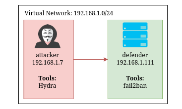
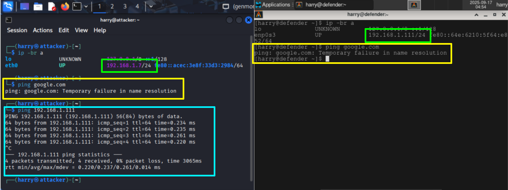

# Enviroment Setup


## Technical Details

### Passwords
- A random selection of 500 passwords were sourced. 
- Kali Linux's `rockyou.txt` password list was used. It can be accessed via the `wordlists` command. 
- Using an existing password list was done to maintain focus on tool usage rather than password list generation, which easily has enough depth to have a whole seprate report written about it. 
- In real-world scenarios, attackers rarely have a guaranteed password list, but for testing purposes, a known list ensures tool functionality.
- I used the `shuf` tool to randomly select passwords for the user profiles. I then created the users "bob, jim and harold" with the passwords. 
- Database passwords were made similar to SSH passwords to highlight typical credential reuse, making it easier for attackers to guess passwords across services.
- It is assumed that the attacker knows the usernames, which is plausible within they were friends in the context of this exercise.

```{=latex}
\input{content/tables/password-table.tex}
```

### Permissions

- root privileges had to be given to be given to bob's user account to progress past "step 1" of the scenario.
- bob, jim and harold have been given ```SELECT, INSERT and UPDATE``` permisions.
- root can only be accessed from a root account, so to access the account the root user password will first need to be discovered. 

### Virtual Network
- In the scenario, the attacker discovered the server's IP address by resolving the domain name, which was publicly shared in a social media post. This could have been virtually implemented but was not required for the scope of the scenario. 
- Both machines were placed on the same virtual network to meet the assignment's requirement of a non-internet-facing environment. A diagram that references this can be seen in Figure 2.


{width=4in}


### Attacker Machine

The attacker machine was chosen for its comprehensive suite of pre-installed security tools, which suited the requirements of this assignment. The only additional configuration involved updating all tools to their latest versions and manually assigning an IP address, as there was no DHCP server available within the virtual network. This setup provided a reliable and ready-to-use environment for conducting the required tests.


### Defender Machine

I selected Arch Linux for the defender machine because it is the Linux distribution I am most familiar with. Its lightweight nature allowed me to efficiently run the assignment on my laptop, and my experience with its package manager made installing and configuring the necessary tools straightforward. Additionally, using Arch Linux ensured that no defense tools or background services would be operating without my knowledge, giving me full control over the environment. This familiarity ensured a smooth setup process and minimized time spent troubleshooting environment issues.

### Proof of Virtual Network


