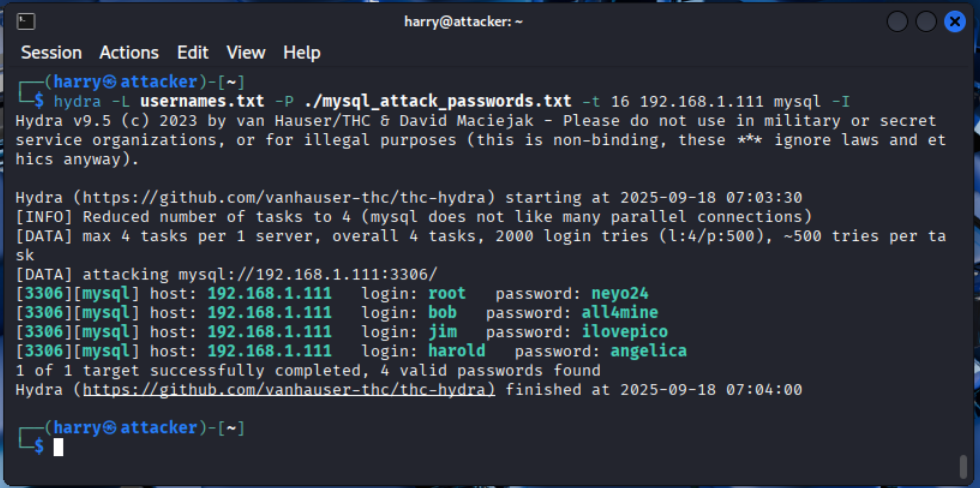
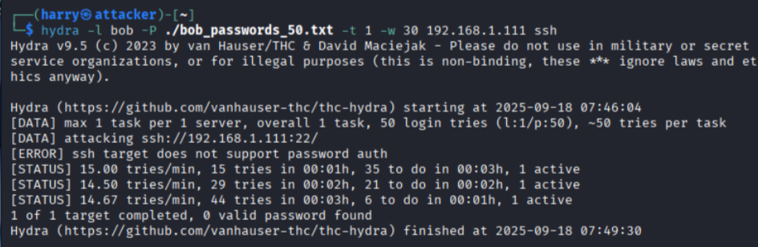
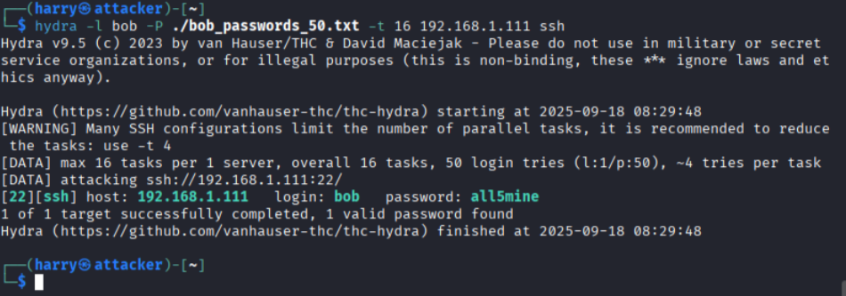
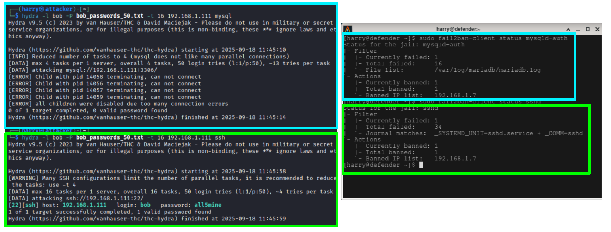
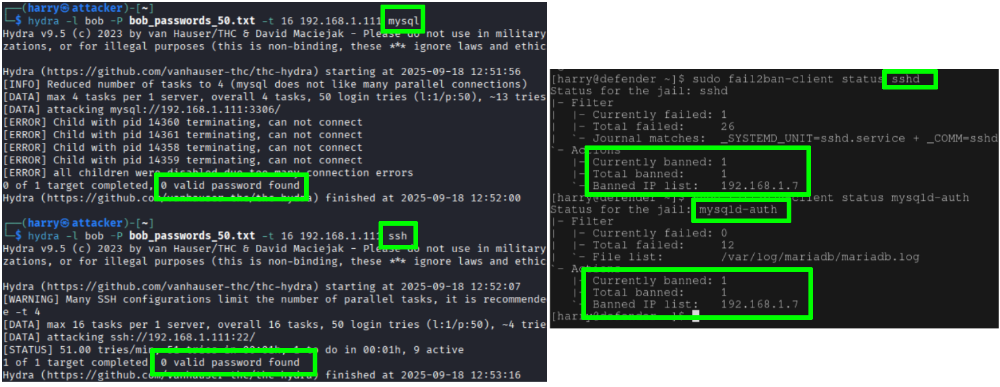
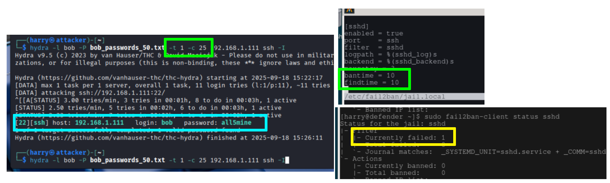

# Scenario Breakdown

## Step 1: The Initial Attack


### Step 1.1

- Began by targeting the MariaDB service (port 3306) using Hydra, with a password list created by sampling "rockyou.txt" and reinserting the captured passwords in random order.

  ```
  hydra -L usernames.txt -P ./mysql_attack_passwords.txt 192.168.1.111 mysql
  ```

  {width=4in}

### Step 1.2
- Used a quick and dirty approach by asking an AI chatbot to generate alternative passwords, speeding up the creation of a realistic password list for the attack.

### Step 1.3

- Execute Hydra brute force attack against SSH service (port 22) on defender machine (192.168.1.111) using the new password list.

  ```
  hydra -l bob -P ./bob_passwords_50.txt -t 1 -30 192.168.1.111 ssh
  ```

{width=4in}

### Step 1.4

- To facilitate testing, the SSH configuration on the defender machine was temporarily modified to allow a higher number of authentication attempts and concurrent sessions:

  ```
  #UsePAM yes                 # Commented out to disable, enabled in Arch by default

  MaxAuthTries 1000           # Allow many attempts per connection
  MaxSessions 100             # Allow multiple concurrent sessions
  MaxStartups 100:30:200      # Increase connection startup limits
  LoginGraceTime 0            # Disable login timeout (or set to 3600)
  ClientAliveInterval 0       # Disable client keepalive checks
  ClientAliveCountMax 0       # Disable automatic disconnections
  ```

### Step 1.5

- Once the SSH configuration was altered on the defender machine finding the passwords was a breeze.

{width=4in}

## Step 2: The Retaliation

### Step 2.1

- SSH logging was enabled by default, but when Mariadb was installed it weirdly was not. To do this I found the following solution[@mariadb_error_log].

  ```

  sudo nvim /etc/my.cnf.d/logging.cnf         # Created logging config

  [mysqld]                                    # Entered this config
  log-error = /var/log/mariadb/mariadb.log
  log-warnings = 2
  general_log = 1
  general_log_file = /var/log/mariadb/general.log

  sudo mkdir -p /var/log/mariadb              # Created log directory

  sudo chown mysql:mysql /var/log/mariadb     # Ensured mysql's permissions

  sudo systemctl restart mariadb              # Restart the service
  ```

### Step 2.2

- When setting up the rules for fail2ban I went for a pretty common config of 3 failed attempts within 10 minutes, and ban duration (10 minutes) to automatically block attacking IP addresses via iptables rules.
- Here is how it was done:

  ```
  [DEFAULT]
  bantime  = 600 #10 minutes in seconds (10 x 60sec)
  findtime = 600
  maxretry = 3

  [sshd]
  enabled = true
  port    = ssh
  filter  = sshd
  logpath = %(sshd_log)s
  backend = %(sshd_backend)s

  [mysqld-auth]
  enabled = true
  port    = 3306
  filter  = mysqld-auth
  logpath = /var/log/mariadb/mariadb.log  #Newly created log path
  ```

- After the service had been restarted I went straight into testing. I used some of the commands below to construct a script that would reset the fail2ban enviroment. 

  ```
  sudo fail2ban-client unban --all          # Clears the jails
  sudo fail2ban-client status sshd          # See the status of ssh attempts
  sudo fail2ban-client status mysqld-auth   # See the status of mariadb attempts
  ```

### Step 2.3

- After my initial test, I encountered an unexpected outcome as seen in figure 7.
  - For the blue-highlighted content, fail2ban worked as intended—Hydra was unable to discover the password because the attacking IP was promptly blocked.
  - However, for the green-highlighted content, although fail2ban did eventually ban the IP, Hydra managed to find the password before the ban took effect. This suggests that the fail2ban response was not fast enough to prevent successful brute force in this scenario.
- To rectify this result I went back and altered the ssh config to it's original config. 
- Refer to Figure 8 for the result after the SSH configuration was restored.

{width=4in}


{width=4in}


## Step 3: Spray Attack

This step demonstrates that bypassing fail2ban is possible, though highly impractical. To prove this, I configured fail2ban with a `bantime` and `findtime` of 10 seconds each, while Hydra was throttled to one attempt every 25 seconds, well outside fail2ban’s detection window. 

- Green: fail2ban banned attempts as expected, but Hydra’s slow pace avoided triggering further bans.
- Yellow: Hydra never exceeded one failed attempt per account, staying below fail2ban’s threshold.
- Blue: Hydra successfully discovered a password from a list of 10, but the process was inefficient.

This confirms that, under controlled conditions, fail2ban can be bypassed, but the effort required makes it an unlikely attack vector.



<!-- ## MITRE ATT&CK Mapping

- T1110.001 - Brute Force: Password Guessing

  - Systematic password attempts against SSH and MariaDB services
  - Using Hydra with username/password lists to guess valid credentials

- T1021.004 - Remote Services: SSH

  - Leveraging SSH protocol for initial access attempts
  - Targeting remote authentication service for system access

- T1110.003 - Brute Force: Password Spraying

  - Using common passwords across multiple accounts
  - "Low and slow" approach to evade detection thresholds

- T1595.001 - Active Scanning: Scanning IP Blocks

  - Port scanning to identify exposed services (SSH port 22, MariaDB port 3306)

- T1078.003 - Valid Accounts: Local Accounts
  - Using compromised local user credentials for system access
  - Potential for lateral movement within flat network topology -->
