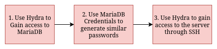

# Scenario Breakdown

## Step 1: The Initial Attack

{width=4in}

- Target MariaDB service (port 3306) with a sample of the "rockyou.txt" with the passwords taken out and shuffled back in.

  ```
  hydra -L usernames.txt -P ./mysql_attack_passwords.txt 192.168.1.111 mysql
  ```

  {width=4in}

- Used AI to generate a script that would produce similar passwords.

- Execute Hydra brute force attack against SSH service (port 22) on defender machine (192.168.1.111) using the new password list.


  ```
  hydra -l bob -P ./bob_passwords_50.txt -t 1 -30 192.168.1.111 ssh
  ```

- For the sake of not failing here I chose to alter the SSH configuration of the ssh service running on the defender machine.

  ```
  #UsePAM yes                 # Commented out to disable, enabled in Arch by default

  MaxAuthTries 1000           # Allow many attempts per connection
  MaxSessions 100             # Allow multiple concurrent sessions
  MaxStartups 100:30:200      # Increase connection startup limits
  LoginGraceTime 0            # Disable login timeout (or set to 3600)
  ClientAliveInterval 0       # Disable client keepalive checks
  ClientAliveCountMax 0       # Disable automatic disconnections
  ```

## Step 2: The Retaliation

- Install and configure fail2ban on defender machine with SSH and MySQL jails set to detect repeated authentication failures
- Configure detection thresholds (3 failed attempts within 10 minutes) and ban duration (10 minutes) to automatically block attacking IP addresses via iptables rules
- Re-execute identical Hydra attacks from Step 1 to demonstrate fail2ban's ability to detect, log, and block authentication attempts in real-time

## Step 3: Spray Attack

- Implement password spraying technique using Hydra with common passwords against all user accounts to test fail2ban's effectiveness against distributed attack patterns
- Attempt to bypass fail2ban protections by varying attack timing and credential combinations to evaluate defensive tool limitations
- Analyze fail2ban logs, iptables rules, and system authentication logs to determine overall defensive success and identify potential evasion techniques

## MITRE ATT&CK Mapping

- T1110.001 - Brute Force: Password Guessing

  - Systematic password attempts against SSH and MariaDB services
  - Using Hydra with username/password lists to guess valid credentials

- T1021.004 - Remote Services: SSH

  - Leveraging SSH protocol for initial access attempts
  - Targeting remote authentication service for system access

- T1110.003 - Brute Force: Password Spraying

  - Using common passwords across multiple accounts
  - "Low and slow" approach to evade detection thresholds

- T1595.001 - Active Scanning: Scanning IP Blocks

  - Port scanning to identify exposed services (SSH port 22, MariaDB port 3306)

- T1078.003 - Valid Accounts: Local Accounts
  - Using compromised local user credentials for system access
  - Potential for lateral movement within flat network topology
